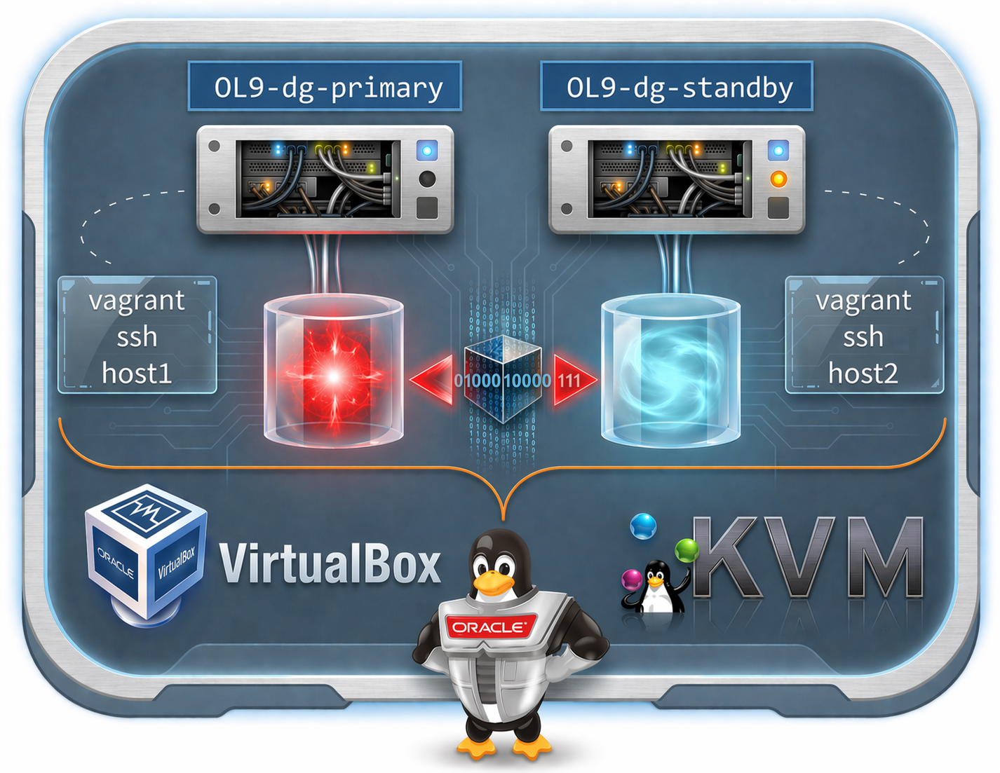

# 🚀 Oracle Data Guard Lab
## Oracle Database 26ai (23.26.0) on Oracle Linux 9

> Build a two-node Vagrant lab with a **primary database** and a **physical standby** configured for **Oracle Data Guard**, using either **VirtualBox** or **KVM/libvirt**.



###### Author: Ruggero Citton (<ruggero.citton@oracle.com>) | Oracle RAC Pack, Cloud Innovation and Solution Engineering Team

## ✨ At a Glance

| Item | Details |
| --- | --- |
| Topology | 2-node Oracle Data Guard lab |
| Database | Oracle Database 26ai Enterprise Edition (`23.26.1.0.0`) |
| Operating system | Oracle Linux 9 |
| Virtualization providers | VirtualBox, KVM/libvirt |
| Vagrant machines | `host1` = primary, `host2` = standby |
| Default sample config | `config/vagrant.yml` is currently set up for `virtualbox` |

## 🎯 What This Project Delivers

- Automated provisioning of a **primary** and **standby** Oracle Database environment.
- Silent Oracle software installation and network configuration.
- Database creation, standby duplication, and **Data Guard Broker** setup.
- Optional **Active Data Guard** mode for read-only standby plus redo apply.
- Post-provision hook support through `userscripts/` for custom shell and SQL automation.

## 🧭 Node Map

| Vagrant machine | Default guest hostname | Role |
| --- | --- | --- |
| `host1` | `primary` | Primary database node |
| `host2` | `standby` | Physical standby node |

## ✅ Prerequisites

1. Review the [top-level prerequisites](../README.md#prerequisites) to prepare Vagrant with either VirtualBox or KVM/libvirt.
2. Download the Oracle Database 26ai Enterprise Edition installer zip from [Oracle](https://www.oracle.com/database/technologies/oracle26ai-linux-downloads.html).
3. Place the zip in `ORCL_software/` with the expected filename pattern:

```text
ORCL_software/LINUX.X64_2326100_db_home.zip
```

The `Vagrantfile` stops early if the installer is missing, if `db_installer.cksum` is missing, or if the configured zip has no matching checksum entry. During the guest install step, the project also verifies the zip's `cksum` CRC and byte count against `db_installer.cksum` before extracting it.

## 📦 Resource Profile

| Resource | Recommended sizing |
| --- | --- |
| Installer zip | ~3.1 GB |
| `/u01` virtual disk per node | 100 GB |
| `/u02` oradata per node | 2 x 20 GB by default, configurable |
| Memory per node | 8 GB default, 6 GB minimum |
| vCPU per node | 2 |

## 🚀 Quick Start

```bash
git clone https://github.com/oracle/vagrant-projects.git
cd vagrant-projects/OracleDG/23.26.0

# 1. Put the Oracle 23ai zip in ORCL_software/
# 2. Review or update config/vagrant.yml
vagrant up
```

Connect to the lab:

```bash
vagrant ssh host1    # primary
vagrant ssh host2    # standby
```

Useful lifecycle commands:

| Action | Command |
| --- | --- |
| Stop the lab | `vagrant halt` |
| Start it again | `vagrant up` |
| Rebuild from scratch | `vagrant destroy -f` |

## ⚙️ Configuration Guide

All project configuration lives in `config/vagrant.yml`.

| Section | Keys | Purpose |
| --- | --- | --- |
| `host1`, `host2` | `vm_name`, `mem_size`, `cpus` | Per-node compute settings |
| `host1`, `host2` | `public_ip`, `private_ip` | Network addresses |
| `host1`, `host2` | `u01_disk` or `storage_pool_name` | Provider-specific storage settings |
| `env` | `provider` | `virtualbox` or `libvirt` |
| `env` | `prefix_name`, `domain` | VM naming and DNS domain |
| `env` | `oradata_disk_num`, `oradata_disk_size` | Oradata disk layout |
| `env` | `db_software` | Installer zip filename under `ORCL_software/` |
| `env` | `db_name`, `pdb_name` | CDB and PDB naming |
| `env` | `cdb` | Enable or disable CDB mode |
| `env` | `adg` | Open standby in Active Data Guard mode |
| `env` | `*_password` | Root, oracle, SYS, and PDB passwords |

## 🔐 Credentials

The default passwords in `config/vagrant.yml` are **demo-only** values (`welcome1`). Replace them before any serious use.

Environment variables can override passwords at provision time:

```bash
export ORACLE_DG_ROOT_PASSWORD=...
export ORACLE_DG_ORACLE_PASSWORD=...
export ORACLE_DG_SYS_PASSWORD=...
export ORACLE_DG_PDB_PASSWORD=...
vagrant up
```

## 🧩 Post-Provision Hooks

Drop files into `userscripts/` to extend the lab after provisioning completes.

| File type | Runs as | Typical use |
| --- | --- | --- |
| `*.sh` | `root` | OS tuning, package installs, extra automation |
| `*.sql` | `SYS` | Schema setup, tablespaces, grants, validation |

Use numeric prefixes if execution order matters, for example `01_prepare.sh` or `02_seed.sql`.

## 🏗️ Provisioning Outcome

| Component | Result |
| --- | --- |
| `host1` primary | Database created with `dbca`, archivelog enabled, force logging enabled, flashback enabled, standby redo logs configured, Data Guard Broker enabled |
| `host2` standby | Auxiliary instance prepared, `RMAN DUPLICATE ... FOR STANDBY FROM ACTIVE DATABASE` performed, broker registration completed |
| Active Data Guard | If `adg: true`, the standby opens read-only with managed recovery |
| Wallet artifact | A PDB wallet archive is left on the primary at `/tmp/wallet_<PDB_NAME>.zip` |

## 🗂️ Project Layout

| Path | Purpose |
| --- | --- |
| `Vagrantfile` | Main orchestration for both providers |
| `config/vagrant.yml` | Environment-specific sizing, networking, and database settings |
| `scripts/` | Provisioning logic for OS, Oracle install, networking, primary, standby, and autostart |
| `userscripts/` | User-defined post-provision shell and SQL hooks |
| `ORCL_software/` | Oracle software media location |
| `images/` | Documentation assets |

## 🛠️ Notes

- With **VirtualBox**, `./primary_u01.vdi` and `./standby_u01.vdi` are intentionally reused across `vagrant destroy` and `vagrant up` cycles to speed up retries. Remove them manually if you want a completely fresh `u01`.
- `SYSTEM_TIMEZONE` is derived automatically from the host offset. If the host offset is not a whole hour, the scripts fall back to `UTC`.
- With **libvirt**, if NFS mounts fail, allow traffic from the libvirt bridge, for example `sudo ufw allow to 192.168.121.1`.
- If you are behind a proxy, export `http_proxy`, `https_proxy`, and `no_proxy` before `vagrant up`. The project uses `vagrant-proxyconf` when available.
