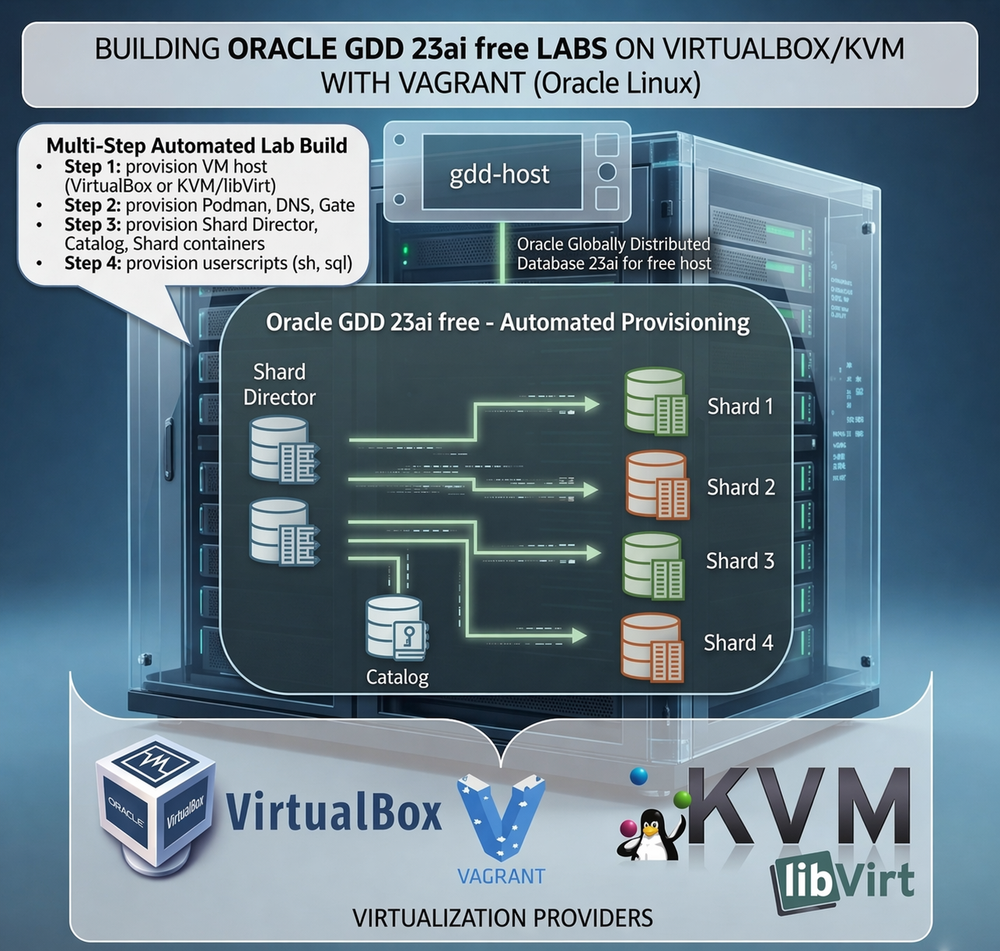

# 🚀 Oracle Globally Distributed Database 23ai on Vagrant (OL8)



> Automated Vagrant lab for Oracle Linux 8 that provisions a single VM and deploys an Oracle Globally Distributed Database (GDD) topology on Podman.

## ✨ What This Project Delivers

| Layer | What you get |
| --- | --- |
| Virtualization | One Oracle Linux 8 VM on `virtualbox` or `libvirt` |
| Storage | Dedicated mounts for `/var/lib/containers` and `/scratch/oradata` |
| Database topology | `1` catalog DB, `4` shard DBs, `2` GSM containers |
| Automation | End-to-end provisioning from `Vagrantfile` plus shell scripts |
| Extensibility | Optional post-setup `.sh` and `.sql` hooks from `userscripts/` |

This `OL8` directory is designed for labs, demos, and local experimentation. It favors fast provisioning over hardening and should be treated as a sample environment rather than a production-ready deployment.

## 🧱 Architecture

### Host VM

| Item | Value |
| --- | --- |
| Base box | `oraclelinux/8` |
| Guest definition | `host1` |
| Minimum memory enforced | `32768` MB |
| Minimum oradata disks enforced | `2` |
| Minimum oradata disk size enforced | `10` GB |

### Podman services started inside the guest

| Compose service | Container name | Fixed IP | Role | Data path |
| --- | --- | --- | --- | --- |
| `primary_gsm` | `gsm1` | `10.0.20.100` | Primary GSM | `/scratch/oradata/dbfiles/GSMDATA` |
| `standby_gsm` | `gsm2` | `10.0.20.101` | Standby GSM | `/scratch/oradata/dbfiles/GSM2DATA` |
| `catalog_db` | `catalog` | `10.0.20.102` | Catalog database | `/scratch/oradata/dbfiles/CATALOG` |
| `shard1_db` | `shard1` | `10.0.20.103` | Primary shard | `/scratch/oradata/dbfiles/ORCL1CDB` |
| `shard2_db` | `shard2` | `10.0.20.104` | Primary shard | `/scratch/oradata/dbfiles/ORCL2CDB` |
| `shard3_db` | `shard3` | `10.0.20.105` | Primary shard | `/scratch/oradata/dbfiles/ORCL3CDB` |
| `shard4_db` | `shard4` | `10.0.20.106` | Primary shard | `/scratch/oradata/dbfiles/ORCL4CDB` |

The container network and service addresses are created by the provisioning scripts and are currently fixed to the `10.0.20.x` range.

## ✅ Requirements

| Category | Requirement | Notes |
| --- | --- | --- |
| Host RAM | `32 GB` minimum | Enforced by `Vagrantfile` |
| Host storage | Thin-provisioned `100 GB` container disk plus `oradata_disk_num * oradata_disk_size` | Real host consumption depends on provider and workload |
| Vagrant | Recent Vagrant installation | The Vagrantfile attempts to install missing plugins automatically |
| Provider | `virtualbox` or `libvirt` | Selected in `config/vagrant.yml` |
| Container images | Reachable Oracle or compatible container images | Defaults point to Oracle Container Registry |

### Provider-specific prerequisites

| Provider | Install on the host | Notes |
| --- | --- | --- |
| `virtualbox` | Oracle VM VirtualBox and Vagrant | Host-only mode uses `vboxnet0` |
| `libvirt` | KVM/libvirt, Vagrant, `ruby-devel`, `libvirt-devel` | Public mode also requires `bridge_nic`; host firewall/NFS rules may need adjustment |

If the default registry images are used, you should have credentials for `container-registry.oracle.com`. You can set them in `config/vagrant.yml` or let `vagrant up` prompt you interactively.

## 🚀 Quick Start

1. Clone the parent project and enter this directory.

   ```bash
   git clone https://github.com/oracle/vagrant-projects.git
   cd vagrant-projects/OracleGDD/OL8
   ```

2. Edit [`config/vagrant.yml`](config/vagrant.yml) for your provider, IP range, storage, and image settings.
3. Start the environment.

   ```bash
   vagrant up
   ```

4. Connect to the guest.

   ```bash
   vagrant ssh
   ```

5. Stop or rebuild when needed.

   ```bash
   vagrant halt
   vagrant destroy -f
   ```

## ⚙️ Configuration Guide

The active sample in [`config/vagrant.yml`](config/vagrant.yml) targets `virtualbox`. A commented `libvirt` example is included in the same file.

### `host1` settings

| Key | Required | Applies to | Description |
| --- | --- | --- | --- |
| `vm_name` | Yes | Both | Base guest name |
| `mem_size` | Yes | Both | Memory in MB, minimum `32768` |
| `cpus` | Yes | Both | Virtual CPU count |
| `public_ip` | Yes | Both | Guest IP address |
| `sc_disk` | VirtualBox only | `virtualbox` | Path for the extra VDI used for `/var/lib/containers` |
| `storage_pool_name` | Optional | `libvirt` | Storage pool for the VM disks |

### `env` settings

| Key | Required | Description |
| --- | --- | --- |
| `provider` | Yes | `virtualbox` or `libvirt` |
| `prefix_name` | Yes | Naming prefix, validated to a maximum of `14` characters |
| `network` | Yes | `hostonly` or `public` |
| `netmask` | `public` only | Guest netmask |
| `gateway` | `public` only | Guest gateway |
| `dns_public_ip` | `public` only | DNS server written into `/etc/resolv.conf` |
| `domain` | Yes | Domain written into guest host configuration |
| `bridge_nic` | `libvirt` + `public` | Host bridge interface |
| `storage_pool_name` | Optional | `libvirt` storage pool for oradata disks |
| `oradata_disk_num` | Yes | Number of oradata disks, minimum `2` |
| `oradata_disk_size` | Yes | Per-disk size in GB, minimum `10` |
| `oradata_disk_path` | Optional | VirtualBox path for generated oradata VDI files |
| `root_password` | Yes in validation | Kept in config, but not applied by the current shell scripts |
| `sharding_secret` | Yes | Used to generate Podman secrets for the stack |
| `podman_registry_uri` | Optional | Container registry endpoint |
| `podman_registry_user` | Optional | Registry username |
| `podman_registry_password` | Optional | Registry password |
| `sidb_image` | Yes | Oracle Database image |
| `gsm_image` | Yes | Oracle GSM image |

### Validation rules enforced by the Vagrantfile

- `prefix_name` must match `[0-9a-zA-Z-]` and stay within `14` characters.
- `mem_size` must be at least `32768`.
- `oradata_disk_num` must be at least `2`.
- `oradata_disk_size` must be at least `10`.
- `public` networking requires `gateway`, `netmask`, and `dns_public_ip`.
- `libvirt` with `public` networking also requires `bridge_nic`.

## 🔄 Provisioning Flow

| Step | Script | Purpose |
| --- | --- | --- |
| 0 | `Vagrantfile` | Validates config, prepares disks, networking, plugins, and provisioner environment |
| 1 | `scripts/setup.sh` | Writes `/vagrant/config/setup.env`, sets timezone, and orchestrates the full setup |
| 2 | `scripts/01_install_os_packages.sh` | Installs OS prerequisites, Podman, `podman-compose`, and related utilities |
| 3 | `scripts/02_setup_storage_container.sh` | Partitions the extra disk and mounts `/var/lib/containers` |
| 4 | `scripts/03_setup_oradata_disks.sh` | Creates the LVM/XFS volume for `/scratch/oradata` |
| 5 | `scripts/04_setup_hosts.sh` | Rewrites `/etc/hosts` and `/etc/resolv.conf` |
| 6 | `scripts/05_setup_GDD.sh` | Creates Podman secrets and network, prepares volumes, and starts the stack |
| 7 | `userscripts/*` | Runs optional post-setup shell or SQL customizations |

### Time zone behavior

The guest time zone is derived from the host time zone when the host offset is a full hour from GMT. If the host uses a non-integer hour offset, provisioning falls back to `UTC`.

## 📁 Generated Files And Paths

| Path | Created by | Purpose |
| --- | --- | --- |
| `/vagrant/config/setup.env` | `scripts/setup.sh` | Shared environment file for all setup stages |
| `/var/lib/containers` | `scripts/02_setup_storage_container.sh` | Dedicated Podman storage volume |
| `/scratch/oradata` | `scripts/03_setup_oradata_disks.sh` | Shared data root for database and GSM container volumes |
| `/opt/.secrets` | `scripts/05_setup_GDD.sh` | Encrypted sharding password and key material |
| `/opt/containers/shard_host_file` | `scripts/podman-compose-prerequisites-free.sh` | Host mapping file mounted into all containers |

## 🧩 Post-Setup Hooks

Anything placed in [`userscripts/`](userscripts) is processed after the stack is up:

- `*.sh` runs as `root`
- `*.sql` runs as `SYS` through `sqlplus`
- Execution order is lexical, so numbered prefixes work well

Example naming pattern:

```text
01_prepare_os.sh
02_create_tablespaces.sql
03_seed_demo_data.sh
```

## 🛠️ Useful Commands

| Command | Purpose |
| --- | --- |
| `vagrant up` | Create and provision the VM |
| `vagrant provision` | Re-run provisioning |
| `vagrant ssh` | Open a shell in the guest |
| `vagrant halt` | Gracefully stop the VM |
| `vagrant destroy -f` | Remove the VM and its disks |
| `sudo podman ps -a` | Inspect the container stack from inside the guest |
| `sudo podman logs catalog` | Inspect the catalog DB container logs |
| `df -h /var/lib/containers /scratch/oradata` | Check mounted storage inside the guest |

## 🌐 Proxy Support

If the host needs a proxy, export the usual variables before running Vagrant. When the `vagrant-proxyconf` plugin is available, the Vagrantfile forwards proxy settings into the guest.

```bash
export http_proxy=http://proxy:port
export https_proxy=http://proxy:port
export no_proxy=localhost,127.0.0.1
```

## ⚠️ Current Implementation Notes

| Topic | Current behavior |
| --- | --- |
| Security posture | Provisioning disables `firewalld` and sets SELinux to `permissive` inside the guest |
| Re-provisioning | The scripts are optimized for first-time setup; repeated `vagrant provision` may require manual cleanup of Podman networks or SELinux file-context entries |
| Domain handling | `env.domain` updates the guest OS configuration, but the container-side domain/search values are still hard-coded in the Podman prerequisite script |
| Podman subnet | The Podman service subnet is fixed in the scripts rather than exposed through `config/vagrant.yml` |

## 🗂️ Repository Layout

| Path | Purpose |
| --- | --- |
| [`Vagrantfile`](Vagrantfile) | Main VM definition, validation, provider setup, and provisioning entrypoint |
| [`config/vagrant.yml`](config/vagrant.yml) | User-editable environment settings |
| [`scripts/setup.sh`](scripts/setup.sh) | Main guest bootstrap script |
| [`scripts/01_install_os_packages.sh`](scripts/01_install_os_packages.sh) | Package installation and base OS changes |
| [`scripts/02_setup_storage_container.sh`](scripts/02_setup_storage_container.sh) | `/var/lib/containers` disk preparation |
| [`scripts/03_setup_oradata_disks.sh`](scripts/03_setup_oradata_disks.sh) | `/scratch/oradata` disk preparation |
| [`scripts/04_setup_hosts.sh`](scripts/04_setup_hosts.sh) | Hostname and resolver setup |
| [`scripts/05_setup_GDD.sh`](scripts/05_setup_GDD.sh) | Secrets, network, and Podman stack startup |
| [`scripts/podman-compose.yaml`](scripts/podman-compose.yaml) | Podman service definition |
| [`scripts/podman-compose-prerequisites-free.sh`](scripts/podman-compose-prerequisites-free.sh) | Container environment defaults and volume preparation |
| [`userscripts/`](userscripts) | Optional user-defined shell and SQL hooks |

## 📜 Support And License

- Sample automation authored by Ruggero Citton for Oracle RAC Pack, Cloud Innovation and Solution Engineering.
- Licensed under the Universal Permissive License (UPL) 1.0 as stated in the source headers.
- This project is presented as sample code and is not described in the source as an Oracle World Wide Technical Support deliverable.
